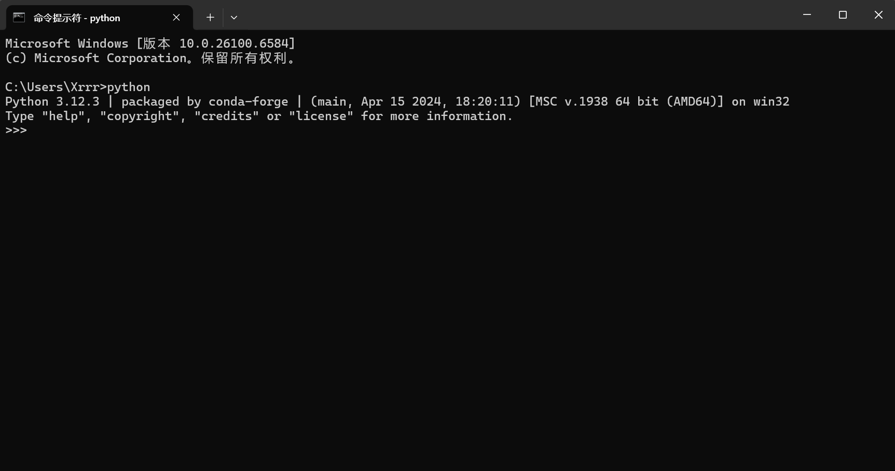
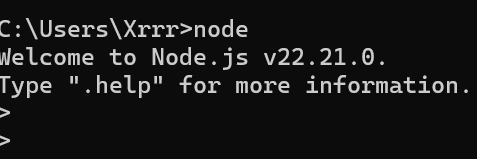
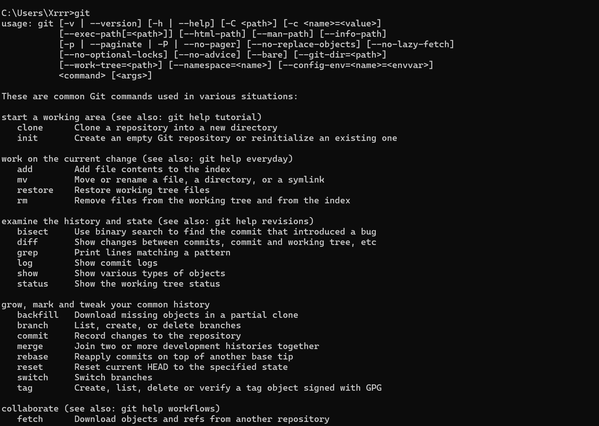
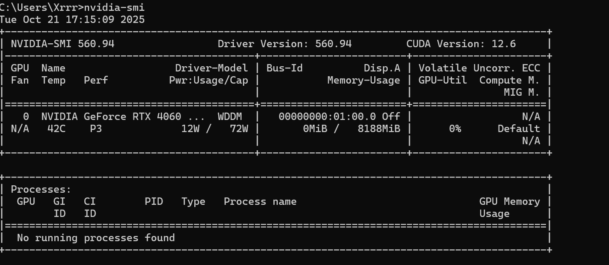
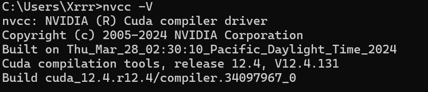

# 仿人机器人创新实践 homework1

## python 安装

## conda安装

## Nodejs安装

## git安装

## Cuda安装

## 与课程相关的问题

### 问题一：仿人机器人为什么要做成人形设计？

**回答：**
 仿人机器人的“人形”设计主要是为了**适应人类环境**。

- 我们的生活空间（楼梯、门把手、工具）都是按人类尺寸设计的，机器人做人形更容易使用这些设施。
- 拥有双臂和双腿的结构能模仿人类的灵活操作和行走方式。
- 此外，人形外观也更有利于**人机交互**，让人更容易接受与之交流或合作。

------

### 问题二：仿人机器人行走控制的最大难点是什么？

**回答：**
 最大的难点是**动态平衡控制**。

- 仿人机器人行走时是非静态平衡的系统，需要实时调整重心和步态，以防摔倒。
- 控制算法必须处理**多自由度的关节协调**、**地面摩擦变化**和**外部扰动**。
- 目前常用的控制方法包括：
  - **ZMP（零力矩点）控制**；
  - **LIPM（线性倒立摆模型）**；
  - **MPC（模型预测控制）** 等先进算法。

------

### 问题三：未来仿人机器人的发展方向是什么？

**回答：**
 未来仿人机器人将向以下几个方向发展：

1. **更智能化** —— 融合大语言模型、视觉和语音识别，实现自然交流与自主决策。
2. **更高机动性** —— 改进步态算法，使机器人能跑、跳、爬楼梯甚至做复杂体操动作。
3. **更低成本与能源效率** —— 采用轻质材料、高效电机、模块化设计，使其更易量产。
4. **更安全的协作** —— 与人类在工业、家庭、医疗等环境中安全共处与合作。